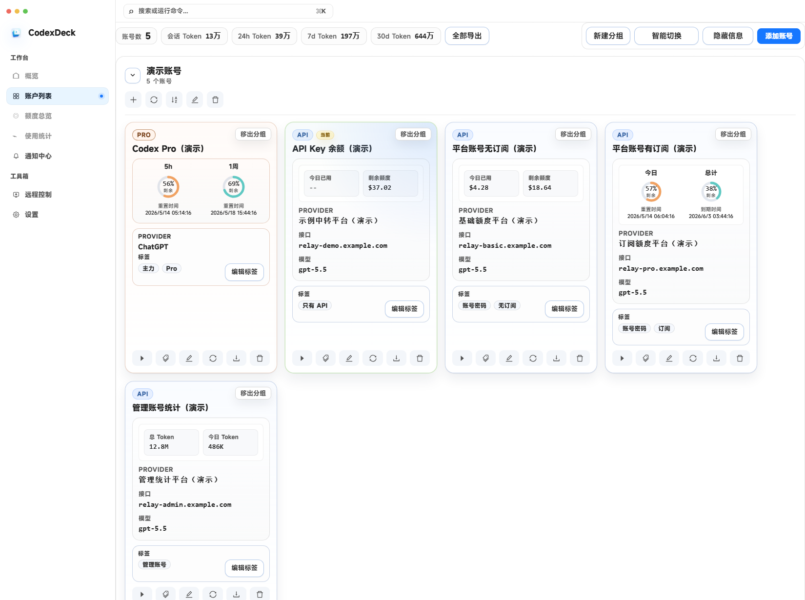
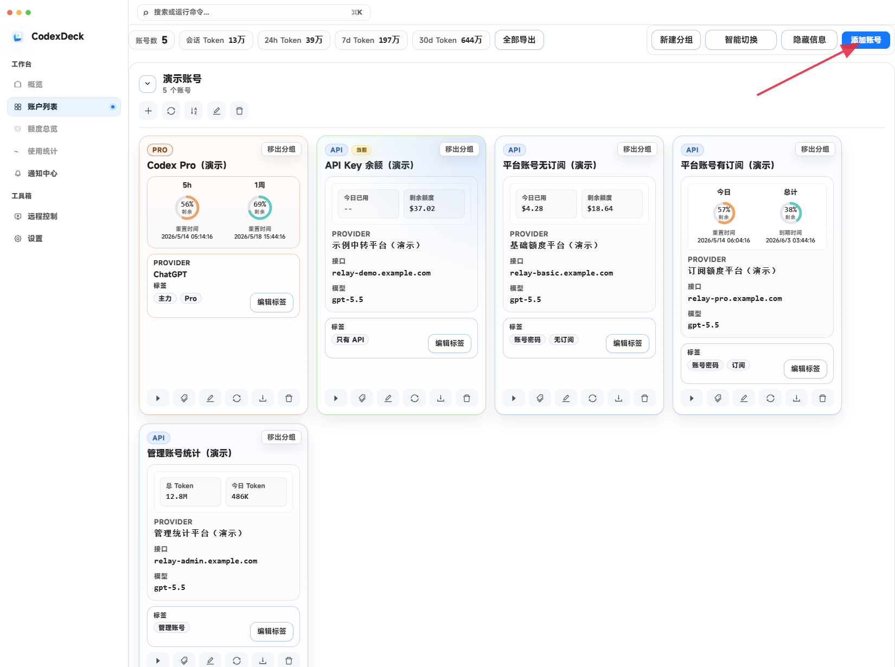
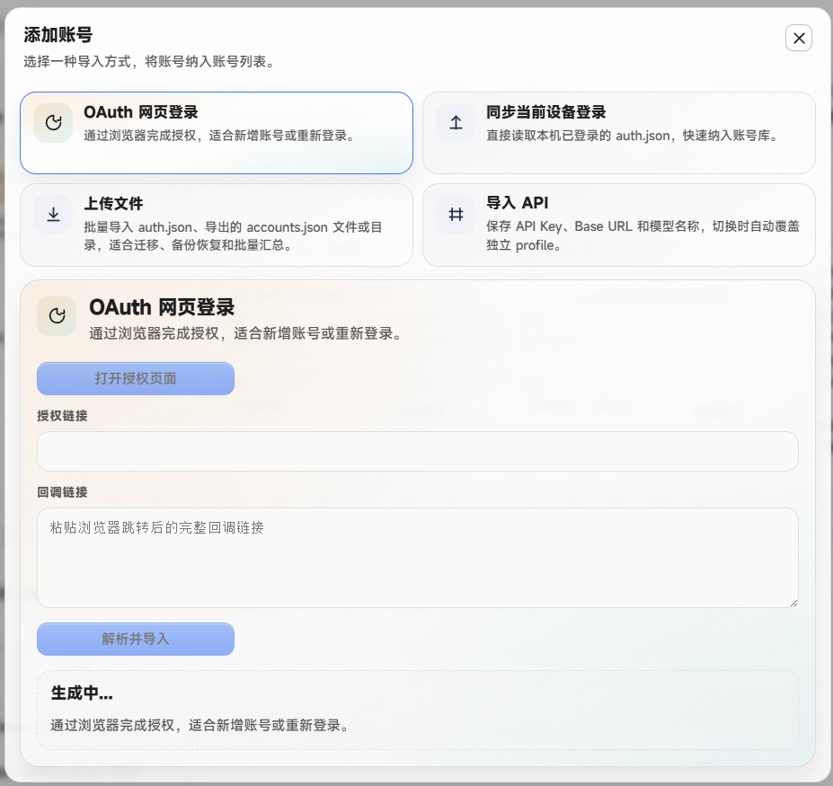
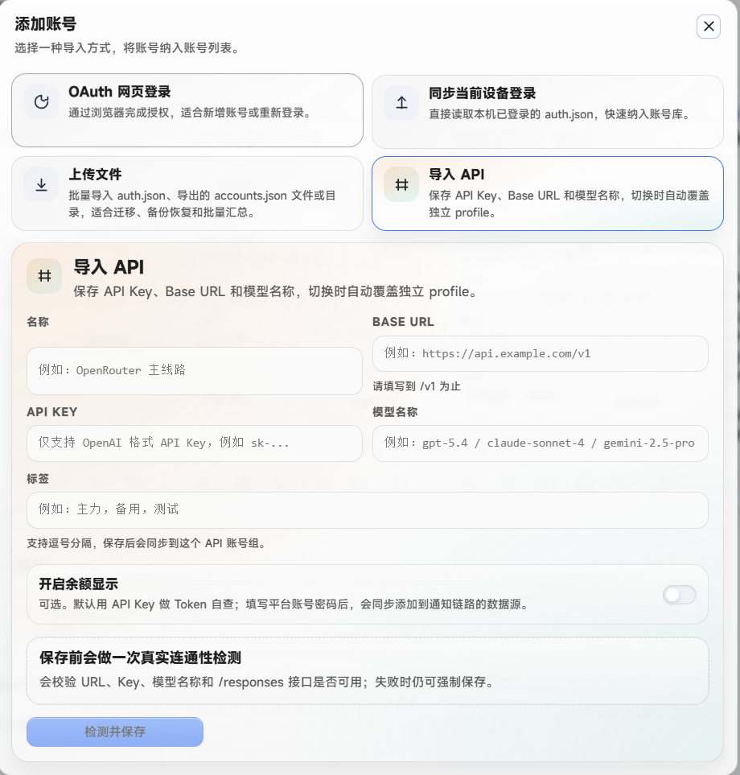
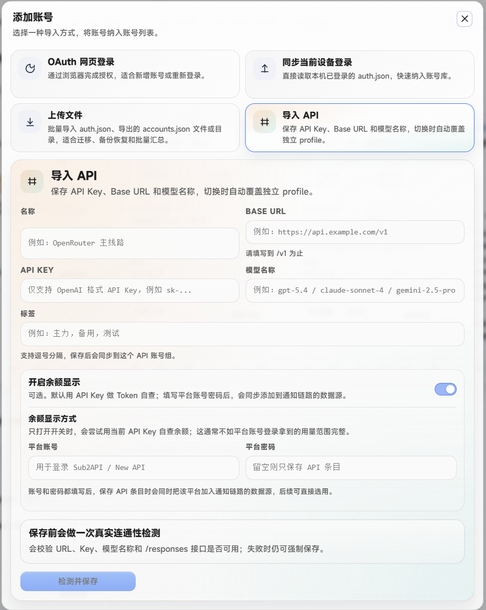
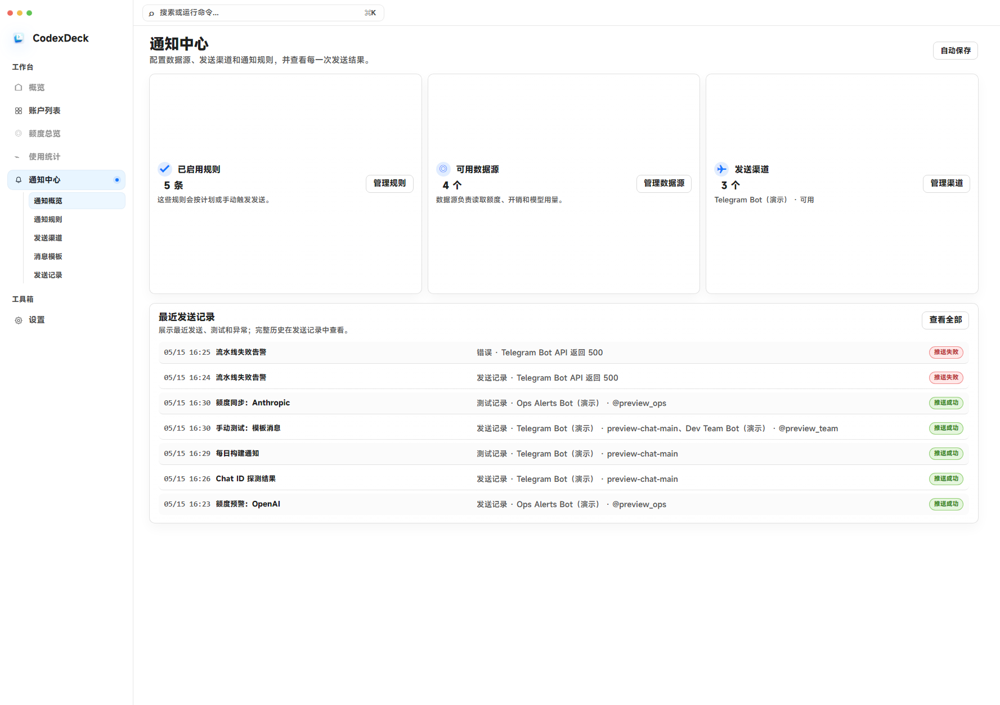
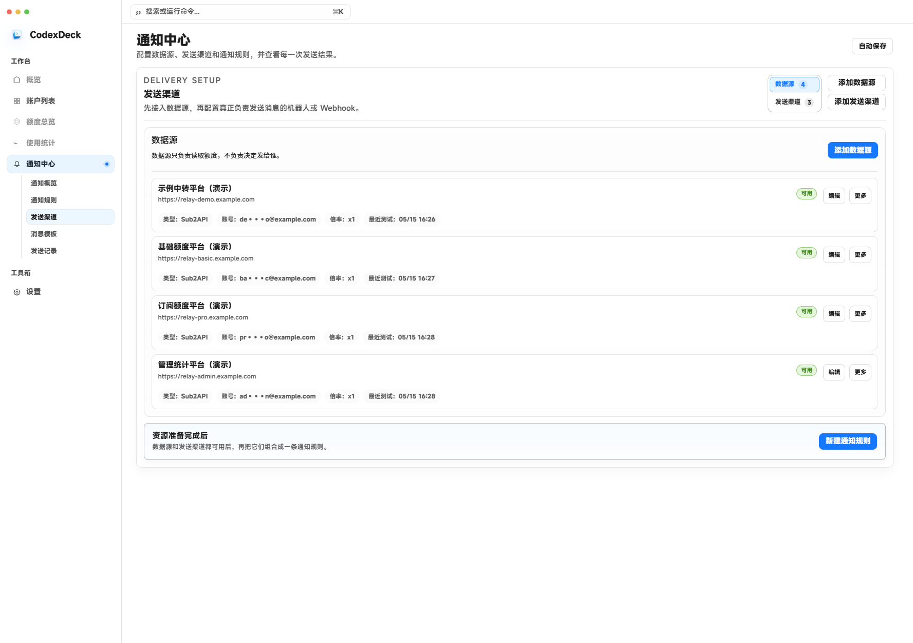
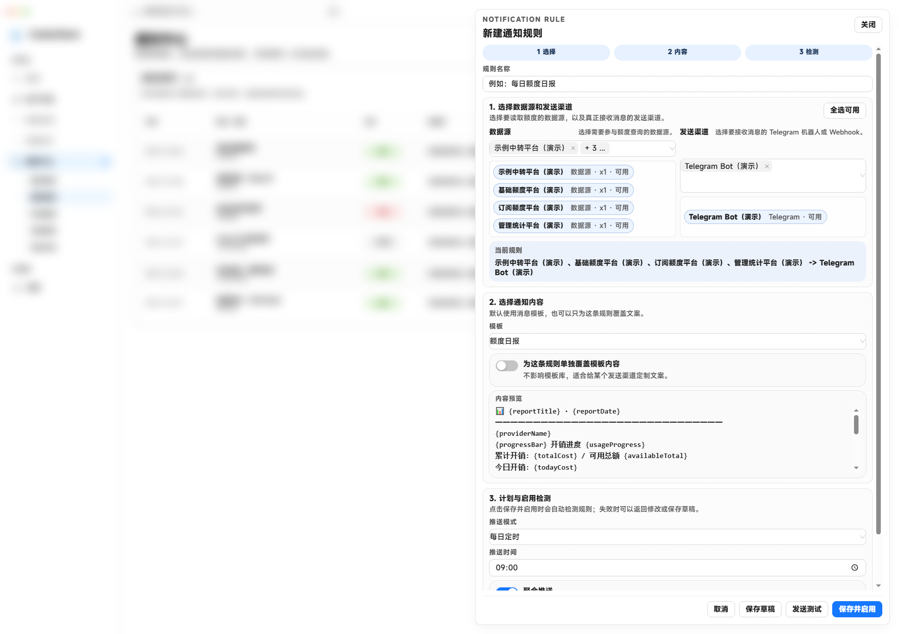

# CodexDeck

CodexDeck 是一个面向 Codex 使用者的桌面工作台，用来集中管理 Codex 账号、API 中转配置、额度状态和通知链路。

它适合同时维护多个 Codex OAuth 账号、多个 API 平台，或者希望把账号状态、额度查询、API 配置和通知规则放到同一个本地控制台里管理的使用场景。



## 主要能力

- 管理 Codex OAuth 账号、账号分组和 API 中转配置。
- 在账号和 API profile 之间快速切换，减少手动修改本地配置文件。
- 查看 Codex 账号额度；API 平台绑定账号后，也可以显示可查询到的用量和余额。
- 通过数据源、发送渠道、消息模板和计划规则创建通知链路。
- 接入外部远程控制安装版 runtime，在 CodexDeck 中启动控制台、查看连接信息并安装手机 APK。

## 使用流程

### 账号与 API 工作台

账号列表会把 Codex 账号和 API 中转条目放在同一个工作区里。API 条目可以是仅 API Key 的配置，也可以绑定平台账号，用于显示余额、订阅额度或管理员统计信息。


### 导入账号

CodexDeck 支持 OAuth 网页登录、同步当前设备登录态、上传账号文件，以及直接导入 API。





导入 API 时，只需要填写名称、Base URL、API Key 和模型名称即可保存为独立 profile。



如果开启余额显示，可以额外填写平台账号信息，用于后续查询 API 平台的余额或用量。



### 创建通知链路

通知链路由几个可复用模块组成：

1. 添加额度或用量数据源。
2. 添加 Telegram Bot、Webhook 等发送渠道。
3. 选择内置模板，或编辑自定义消息模板。
4. 创建通知规则，设置每日定时、间隔推送或手动触发，并在保存前发送测试消息。







### 远程控制

远程控制页会接入外部安装版 runtime。CodexDeck 只作为外壳，负责启动/停止控制台、展示运行状态、最近日志、控制台地址、连接地址、连接码和手机 APK 安装入口。

普通 Codex 不会被手机端接管；手机端连接的是安装版受控 Codex。

## 当前状态

CodexDeck 2.0.4 覆盖账号管理、API profile 管理、额度可视化、通知规则、provider 写入修复，以及外部远程控制安装版 runtime 接入。

API 中转 profile 会固定写入 `codexdeck_api` provider，并禁用 responses websocket。切回普通 Codex 账号时，会同步线程 provider 回 `openai`，以降低会话不可见风险。

## 本地开发

```bash
npm install
npm run dev
```

桌面端预览：

```bash
npm run dev:desktop
```

远程控制开发/打包需要一份外部安装版 runtime。源码仓库只保留适配层，不提交 runtime 内容。打包时需要显式传入 runtime 来源，或设置环境变量：

```powershell
$env:CODEXDECK_REMOTE_RUNTIME_SOURCE = "<runtime-install-root>"
```

打包脚本会把 runtime staged 到：

```text
src-tauri/resources/codex-command-runtime/
```

该目录除 `.gitkeep` 外被 `.gitignore` 忽略，不进入源码仓库；发布脚本会排除运行态日志、设备状态、受控 Codex 用户数据和 pid 文件。

常用验证：

```bash
npm run lint
npm run build
cargo test --manifest-path src-tauri/Cargo.toml
```

## License

MIT
