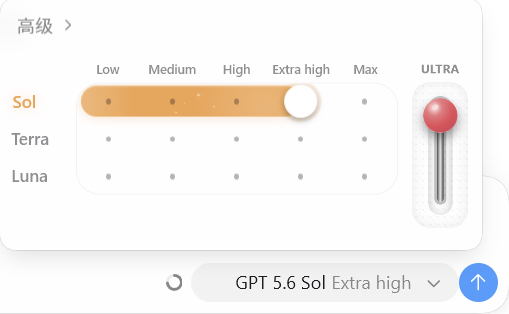

# CodexDeck

CodexDeck 是一个基于 **React + Tauri** 的桌面工具，用来管理 Codex 账号、OpenAI 兼容 API、多供应商模型目录、混合登录配置、路由模式、账号切换、用量查看和通知数据源。

仓库地址：<https://github.com/Barbital11111/CodexDeck>

## 项目边界

- 管理 Codex OAuth 账号、API Key 条目和账号分组。
- 为每个账号/API 维护独立 `auth.json` 与 `config.toml` profile。
- 支持普通账号、API 登录、混合模式三种主要使用方式。
- 支持 API 余额显示、Sub2API/New API 额度查询和通知数据源配置。
- 支持增强启动相关开关，用于补齐 API 登录时的部分 Codex 页面能力。
- 支持 API 模型探测、菜单模型与实际请求模型分离、模型上下文窗口配置和本地模型路由模式。
- 支持 Windows Codex Desktop 受控副本、多模型选择器与可选的 GPU 加速禁用启动。
- 支持 classic / modern 两套 PC 端 UI 皮肤并行开发。
- 不内置 Sub2API、Android 端、cloudflared 或外部反代源码。

如需 Sub2API、New API、NAS 网关或其他中转服务，请作为外部服务部署，然后在 CodexDeck 中按普通 API 配置填写：

```text
Base URL: http://<your-gateway>/v1
API Key:  <gateway-api-key>
Model:    <model-name>
```

## 下载与安装

- Windows 安装包从 [GitHub Releases](../../releases/latest) 下载，可选择 NSIS `setup.exe` 或 MSI。
- 正式版保留 Tauri updater；Release 同时提供签名文件与 `latest.json`，用于后续应用内更新。
- 多模型模式需要本机已安装官方 Codex Desktop。CodexDeck 只复制并 patch 自己的受控副本，不修改 `WindowsApps` 中的官方文件。

## 本地开发

### 环境准备

- Node.js 22
- Rust stable
- Windows 或 macOS

### 安装依赖

```bash
npm install
```

### 启动桌面开发预览

```bash
npm run dev:desktop
```

该命令会把开发预览使用的数据隔离到仓库内 `.dev-runtime/`，避免本地调试时覆盖正式安装版保存的账号、profile 与 `~/.codex` 配置。

如果只需要浏览器页面预览：

```bash
npm run dev
```

## 主要功能

### 账号管理

- 支持 OAuth 登录导入。
- 支持上传单个或多个 `.json` 文件批量导入。
- 支持导入/导出账号备份。
- 支持账号分组、标签、智能切换和隐藏敏感信息。

### API 与混合模式

- 支持 OpenAI 兼容 `Base URL + API Key + Model` 配置。
- 保存 API 配置时只写入本地；模型能力与额度由用户按需手动探测，避免保存操作被网络请求阻塞。
- 支持预设供应商入口，包括 MiniMax、Xiaomi MiMo、Xiaomi MiMo Token Plan、DeepSeek、Z.AI GLM 和 Kimi。
- 支持探测上游 `/models`，并在账号内维护模型目录；菜单模型 ID、显示名称、实际请求模型和上下文窗口可以分别编辑。
- 上下文窗口在 UI 中使用 `256K`、`512K`、`1M` 这类格式展示，内部仍保存为 token 数。未知非 GPT 模型默认推荐 `256K`，GPT 系列不自动补写。
- API profile 默认写入 `codexdeck_api` provider。
- 混合模式会保留官方账号态，并通过 `experimental_bearer_token` 走指定 API 中转。
- 切换账号时会同步 Codex 线程 provider，降低历史会话不可见风险。
- 路由模式会在本机临时启动只监听 `127.0.0.1` 的模型路由，将多个 API 账号的已选模型聚合为一个 OpenAI 兼容入口；关闭或切换模式时会停止旧路由。

### Codex 模型切换卡片



- 在 Codex 输入区直接切换 Terra、Sol、Luna，并通过卡片内的滑杆选择 `Low / Medium / High / Extra high / Max / ULTRA` 六档推理强度。
- 模型、档位、拉杆状态和光效会随选择联动，并适配 Codex 的深色与浅色界面。
- 第三方模型不会继承上述六档：MiniMax-M3 使用 `None / High` 作为思考开关，GLM-5.2 与 DeepSeek 使用 `None / High / Max`，未知模型默认不声明推理档位。
- 启动时会校验官方 Codex 版本与现有受控副本；仅在来源或 patch 版本变化时重建，平时复用已验证副本。
- Luna 的 `ULTRA` 保留统一的视觉档位，实际推理强度仍按 `Max` 发送。
- 旧候选副本会避开正在运行的目录后清理；patch 备份和 provider 备份默认仅保留最近一份。
- 启动需要打开多模型模式才能覆盖启动模型切换卡片,如果不行请复制源代码修一下
### 额度与通知

- 展示账号用量窗口和 API 余额信息。
- 支持 Sub2API/New API 额度来源配置。
- 支持平台账号无订阅、有订阅和管理账号模式。
- 支持 DeepSeek、MiniMax、GLM、Kimi 等可查询平台的 API Key 额度刷新；MiMo Token Plan 订阅标签目前采用手动选择，不做余额查询。
- 通知中心可配置数据源、投递通道、模板与规则。

### 启动与增强

- 一键切换账号并启动 Codex。
- 支持直接启动新版 `ChatGPT.exe` 以及旧版 `Codex.exe`，并避免把普通 ChatGPT 客户端误识别为 Codex。
- 找不到桌面应用时自动回退到 `codex app`。
- “禁用 Codex GPU 加速”会为 Windows 直接 exe 启动追加 `--disable-gpu`；不会把参数传给 `codex app` fallback 或 Windows Store/AUMID 启动。
- 可选同步 Opencode OpenAI 授权。
- 可选在切换后重启已选编辑器。
- API 登录可启用增强启动，补齐部分官方账号态页面能力。


## 验证

常用检查命令：

```bash
npm run lint -- --max-warnings=0
npx tsc --noEmit
node --test scripts/tests/*.mjs
npm run build
cargo fmt --manifest-path src-tauri/Cargo.toml --check
cargo test --manifest-path src-tauri/Cargo.toml
cargo check --manifest-path src-tauri/Cargo.toml --release
```

## License

MIT，详见 [LICENSE](LICENSE)。
